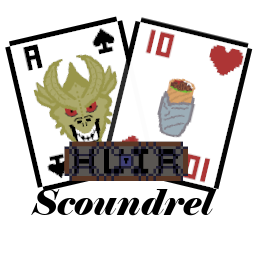

<html lang="es-ES">
<head>

<title>Scoundrel, un RPG de cartas</title>
</head>
<body>

<h1>¿De qué va el juego?</h1>

Scoundrel va de intentar vaciar el mazo sin morir en el intento, teniendo  armas, curaciones y lo más importante... ENEMIGOS.

Los enemigos irán desde un simple Slime, un dragon, Drácula, ¿Ryuk?

¿No sabes jugar? ¡No te preocupes! El juego cuenta con un boton de  ayuda en el menú principal que te explica?

Música utilizada en el juego: <a href="https://www.youtube.com/watch?v=g9RgwVFaaeM">the legend of zelda ⚔️ jazz lofi vibes ~ Tama's Little Music Shop</a>

<h1>¿Problemas con Windows Defender?</h1>

El juego no tiene ningún tipo de software malicioso, simplemente somos dos estudiantes y no podemos pagar un certificado en condiciones. El código del juego está libre por si deseais revisarlo vosotros mismos y en caso de robaros  el juego pues, ¿en serio quereis que os asocien con esta cosa? Cualquier cosa, contactarme (programador) a <a href="mailto:jorgejorgemonovar@gmail.com?subject=Problemas%20con%20Scoundrel&body">mi correo</a>

<h1>Problemas con "Esta aplicación necesita un Java Runtime Enviroment version 23"</h1>

Instalar la versión de Java 23 debería solucionar el problema

<a href="https://www.oracle.com/es/java/technologies/downloads/#jdk23-windows"> Java 23 para Windows </a>
</body>
</html>